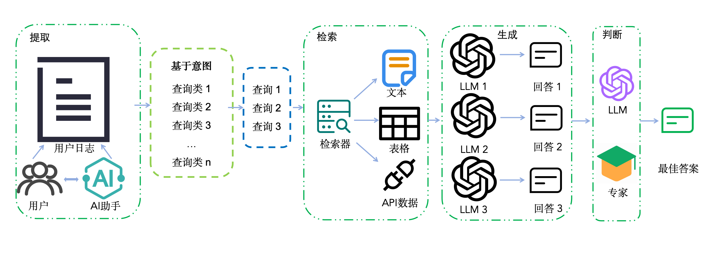

# Fans-Pilot: A Benchmark for Online Financial System
## 简介
大语言模型在各个专业领域的任务上取得了极大的性能提升，研究人员通过各式各样的测试集对大语言模型的各项能力进行评测。在金融领域，由于专业性、实时性等独特挑战，大语言模型在应用时往往需要检索增强生成技术的辅助。但因为金融数据的私密性，金融领域检索增强生成测试数据集较为匮乏。为此，我们基于真实的金融助手场景，利用动态接口数据和文本数据，提出了基于意图分类的金融领域检索增强生成测试数据集Fans-Pilot。该数据集覆盖了个股分析、宏观分析等多个金融问答领域，能够全面测试金融助手的检索增强生成能力。通过在多个大语言模型上的实验评测，为筛选适合金融问答的大语言模型提供了依据，为金融领域的测试数据集提供了补充。

## 数据集的构建

1. 根据在线金融助手的情况，得到对查询的意图分类[intents](query_base/intents.json)；
2. [QueryIntentClassifier.py](generate/QueryIntentClassifier.py): 用LLM标注已有查询的意图；
3. 提取查询类（query base），并将第二步的结果转化为[query_base](query_base/query_base.json)的格式；
4. 检索相关信息：对于数值型查询，调用Tushare API查询API相关数据，细节见[ApiRetriever.py](generate/ApiRetriever.py): ；对于内容型查询，从数据库或Bing中检索到相关文档，细节见[TextRetriever.py](generate/TextRetriever.py): ；
5. [RelevanceScorer.py](generate/RelevanceScorer.py): 使用LLM，对每个内容型查询与其对应的相关文档的相关性进行打分；
6. [LowRelFilter.py](generate/LowRelFilter.py): 保留相关分数不低于lower_bound的文本，默认lower_bound为6分；
7. [Generator.py](generate/Generator.py): 使用LLM为每个查询生成回答；
8. [Cluster.py](generate/Cluster.py): 把所有查询及其回答汇总到两个文件当中（分为数值型和内容型）；
9. 对于数值型查询，将由开发人员直接检查其正确答案；对于内容型查询，使用另一个LLM获取已有答案中最优的一个（[BestResponse.py](evaluate/BestResponse.py)），再经过专家的矫正，得到最佳答案。

## 两类查询
根据回答方式与相关信息的类比，我们将查询分为数值型查询和内容型查询。

### 数值型查询
数值型查询的回答的数值，其相关信息主要是动态接口数据，共有104条，全部集中在“宏观分析-经济指标解读”、“个股分析-个股数据查询”、“市场分析-市场数据查询”、“基金分析-基金数据查询”四个二级意图下。数值型查询对应的数据见[value.jsonl](dataset/value.jsonl)。

### 内容型查询
内容型查询的回答是文本内容格式，其相关信息也都为文本数据，共有212条。内容型查询对应的数据见[content.jsonl](dataset/content.jsonl)，相关文本的数据库见[corpus.jsonl](dataset/corpus.jsonl)。

## 评价
对于数值型查询，直接使用准确率（Accuracy）进行评价。

对于内容型查询，使用基于相似度的指标和基于模型的指标进行评价，其中基于相似度的指标包括Rouge-l、BLEU和余弦相似度，基于模型的指标包括幻觉、完备性和相关性。

